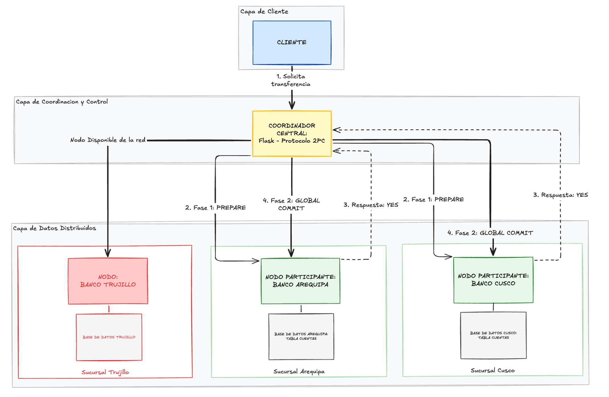

# Bases de datos distribuidas — Lab 08

Implementación del protocolo **Two-Phase Commit (2PC)** sobre PostgreSQL para garantizar atomicidad, consistencia y recuperación en transacciones distribuidas.

## Casos de estudio

### FarmaAndes S.A.

Cadena farmacéutica con centros de distribución en Arequipa, Lima y Cusco. El sistema orquesta transferencias de inventario con 2PC entre sedes.


### Sistema Nacional de Bancos Cooperativos

Red financiera de 3 nodos (Arequipa, Cusco, Trujillo). Implementa transferencias bancarias distribuidas con 2PC, simulación de fallos de red y caída de nodos, más recuperación posterior.



## Stack

- **Python** (Flask)
- **PostgreSQL**
- **2PC** protocolo sobre conexiones nativas

## Instalación

```bash
pip install -r requirements.txt
```

## Integrantes

- Barrios Medina, Mathias Alonso
- Hancco Mullisaca, Sergio Danilo
- Huacani Jara, Denise Andrea
- Pacheco Palo, Fabiana Francinet
- Quispe Condori, Alvaro Raul
